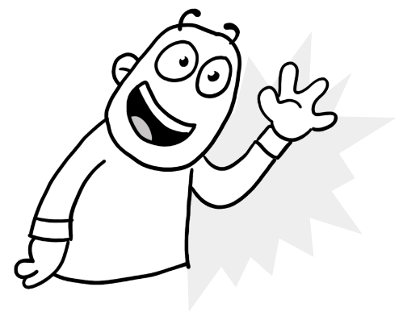
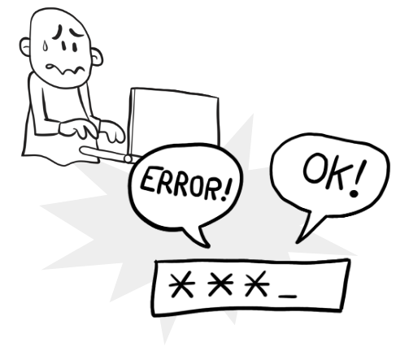

# Curs de testing UdG 2021

## Dia 2

- Cobertura de codi
- Introducció a Test Drive Development (TDD)

Presentació:

- [PDF](Dia2_Presentació.pdf)

## Exemples

### Cobertura i repàs

Cistella de la compra:

* S’han de poder afegir i treure quantitats de productes, buidar la cistella i saber la quantitat d’articles que hi ha en la cistella
* Calcula el preu del transport:
  * Hi haurà un preu de transport base per compres inferiors a 5Kg
  * El preu del transport s’incrementarà en 1€ per cada 5Kg de pes
  * Si el total és superior a 50€ el transport és gratuït
  * Els usuaris VIP tenen transport gratuït
* Ha de calcular el total a pagar amb transport inclòs
  * Si es compren més de quatre unitats del mateix producte es rebaixa un 5% en el preu del producte

### TDD: El Saludador automàtic

s'ha detectat que les persones cada dia són menys amables amb la gent que els envolta. Per això una startup vol desenvolupar un programa que saludi:

- Ha de rebre el nom de la persona
- Ha de comprovar que la primera lletra del nom està en majúscules
- Ha de saludar de forma diferent segons la hora que sigui:
  - De 6:00 a 12:00 ha de dir "Bon dia"
  - De 14:00 a 20:00 ha de dir "Bona tarda"
  - De 21:00 a 06:00 ha de dir "Bona nit"
- Si el nom té més de dues paraules ha d'afegir "Senyor"

### TDD: Validador de contrasenyes

Escriure un validador de contrasenyes que tingui les característiques següents:

Les contrasenyes han de tenir:

- 8 caràcters de llargada com a mínim
- Han de tenir més de 2 números
- Han de tenir majúscules i minúscules
- No hi poden haver tres caràcters seguits iguals
- Si hi ha un caràcter especial els números poden ser iguals
- Si no hi ha caràcter especial els números han de ser diferents
- La contrasenya no pot ser el nom d’usuari, ni el nom de l’usuari al revés

### Altres

[Més exemples de TDD Katas](https://codingdojo.org/kata/)
