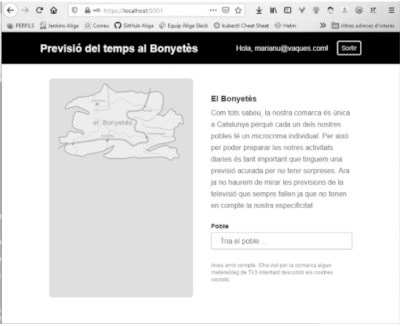
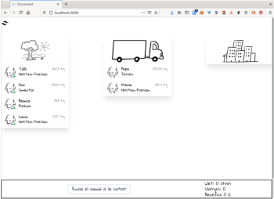
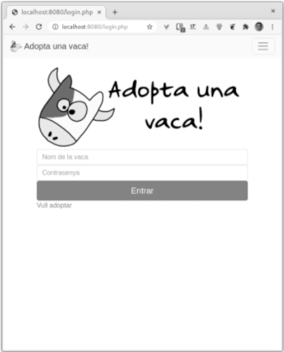

# Curs de testing UdG 2021

## Dia 3

- Tests d'Interficies d'usuari web

Presentació:

- [PDF](Dia3_Presentació.pdf)

## Exemples

### Automatitzar webs

### Previsió del temps a la comarca de "El Bonyetès"

Els tests han de comprovar:



- Comprova que no es veu res sense fer login
- Comprova el funcionament del login
- Comprova que es pot registrar un usuari
- Comprova que un usuari correcte pot veure les previsions
- Comprova que les previsions d’un poble són les mateixes encara que hi vagis dos cops
- ...

### Comprovar el transport de vaques

Es tracta d'una aplicació web formada per dos components:

- Una web en C# Blazor que s'instal·la en un servidor web
- Backend rest en Java

Iniciar el sistema en contenidors:

```powershell
cd day3-3
docker-compose up
```

s'ha detectat que les persones cada dia són menys amables amb la gent que els envolta. Per això una startup vol desenvolupar un programa que saludi:



- Comprova que es poden posar vaques al camió
- Comprova que no es poden posar més de 1000 kg en el camió
- Comprova que es poden treure vaques del camió
- Comprova que es poden enviar les vaques a la ciutat
- Comprova que els valors de la barra canvien
- etc.

### Adopta una vaca

Es tracta d'una web PHP instal·lada en un servidor Apache HTTPd. Tot ha estat empaquetat en un contenidor docker.



Iniciar el sistema

```bash
docker run -p 8080:80 -d utrescu/adoptavaca
```

Les proves es poden fer sobre el port 8080 de la màquina local

- Comprova que els usuaris amb contrasenyes incorrectes no poden entrar
- Comprova que no s’entra si no hi ha usuari o contrasenya
- Comprova que un usuari correcte pot entrar:
  - matilda : adlitam
  - conxita : energy
  - peluda : password
- Comprova que un usuari que ha entrat si surt no pot tornar a la pàgina privada.
- ...
