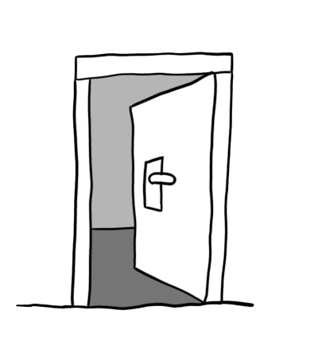
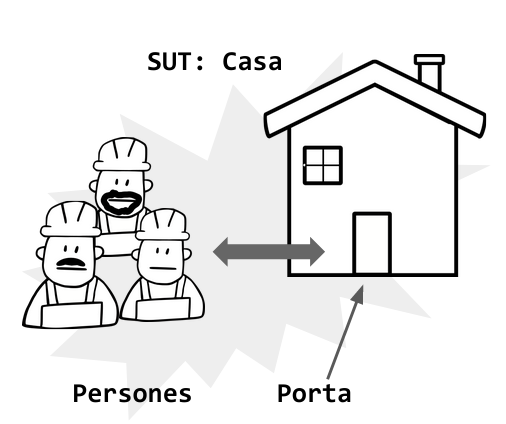
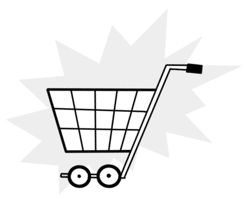
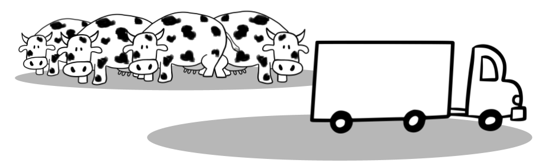

# Curs-Testing-Udg-2021

## Dia 1

- Introducció al testing amb C#
- Eines:
  - xunit
  - Moq
  - FluentAssertions
  
Presentació:

- [PDF](Dia1_Presentació.pdf)

## Exemples

Llista amb el codi font dels exemples.

### Provar Porta

Comprova el funcionament d'una Porta que té les característiques següents:

- La porta pot tenir clau o ser sense clau
- S’ha de poder obrir i tancar
- Si té clau:
  - S’ha de poder girar la clau al pany
  - Si està tancada amb clau la porta no s’obre

Directory: [day1-1](day1-1)

### Comprovar entrada a la Casa

Comprova l'entrada de gent en una casa:

- En la casa hi entren i surten persones
  - Les persones no poden entrar, ni sortir si la porta està tancada
  - La porta es pot obrir i tancar
  - La mateixa persona no pot entrar si ja és a dins (ni pot sortir si no està a dins)

Directory: [day1-2](day1-2)

### Cistella de la compra

Comprova el funcionament d'una cistella de la compra:

Les característiques són:

- S’han de poder afegir i treure quantitats de productes i buidar la cistella
- Ha de saber la quantitat d’articles
- Hi haurà un preu de transport base
  - El preu del transport s’incrementarà en 1€ per cada 5 Kg de pes
  - Si el total és superior a 50€ el transport és gratuït
  - Si es compren més de quatre unitats del mateix producte es rebaixa un 5% en el preu del producte
  - Els usuaris VIP tenen transport gratuït
- Ha de calcular el total a pagar amb transport inclòs

Directory: [day1-3](day1-3)

### Transport de vaques

Comprova que es poden posar vaques en un camió però sempre complint les mesures de seguretat:

- El camió té un pes màxim que no s'ha de superar
- La raça de la vaca determina la quantitat de llet que produirà

Directory: [day1-4](day1-4)

