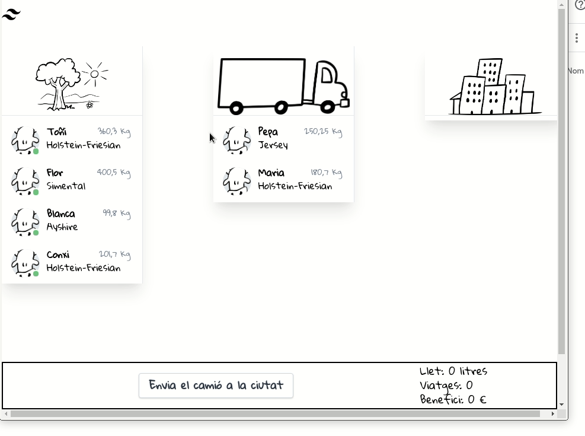

# Tests d'UI de la web de Vaques

Projecte per fer tests d'UI de la web de vaques en C#.

Es pot iniciar amb `docker-compose`

```bash
docker-compose up
```



## Què provar?

Encara que no ho diu (encara) el camió pot portar com a màxim 1000 kg.

- Comprova que es poden posar vaques al camió
- Comprova que no es poden posar més de 1000 kg en el camió
- Comprova que es poden treure vaques del camió
- Comprova que es poden enviar les vaques a la ciutat
- Comprova que els valors de la barra canvien
- ...
